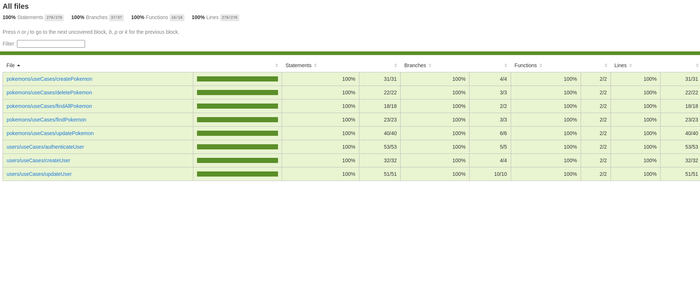
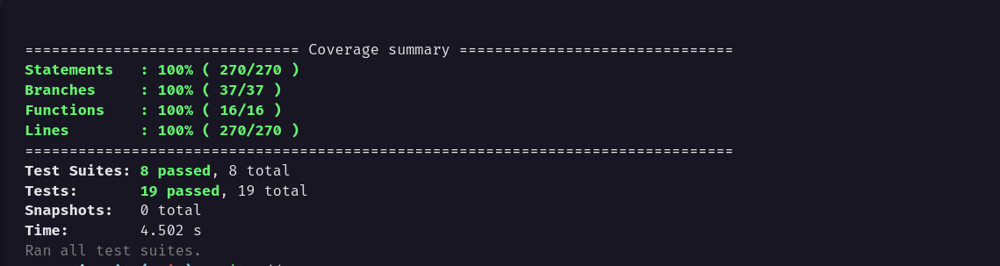
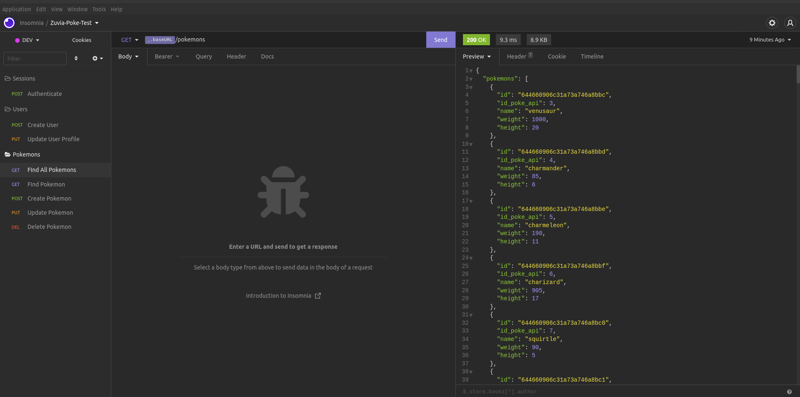

<p align="center">
  <a href="https://www.zuvia.com.br" target="blank"></a>
</p>

</br>

<p align="center">
    <a href="https://www.linkedin.com/in/alanhrc/" target="_blank"></a>
    <a href="https://www.facebook.com/alan.camargo.3914" target="_blank"></a>
    <a href="https://contate.me/alanhrc" target="_blank"></a>
</p>

</br>

## Description Test

### Technologies used
- Nodejs
- Express
- Prisma
- Mongodb
- SQlite
- Jest
- Swagger

## Installation

```bash
$ npm install
```

## Running the app

```bash
# Obs
During app startup, a request is made to the api 'https://pokeapi.co/' and the local database is populated with 100 pokemons and 1 user test.

Pokemons quantity can be change in '.env' 'API_POKE_LIMIT'
```

```bash
# Development using Docker Compose and MongoDB

$ cp .env.example .env

$ docker compose up --build
```

```bash
# Development using SQlite

$ cp .env.template .env

$ change variable 'provider' in 'prisma/schema.prisma' to 'sqlite'

$ use one of 'id' to 'sqlite' in 'models'

$ npm run dev

# Example change id ⬇
```

<p align="center">
  <a href="#" target="blank"></a>
</p>

## Test

```bash
# Unit tests

$ npm run test
```

<p align="center">
  
</p>

<p align="center">
  
</p>

</br>

## Prisma Studio

```bash
# Prisma studio interface

$ npx prisma studio

# Open port http://localhost:5555 to view database
```

<p align="center">
  
</p>

<p align="center">
  
</p>

</br>

## Docs Swagger

```bash
# Swagger docs

$ url http://localhost:3333/docs to view documentation
```

<p align="center">
  
</p>

</br>

### Contains a file `Insomnia` with routes and params project to test manually, you can import file

</br>

<p align="center">
  
</p>

## Require Features

### User

<p align="center">
  
</p>

<p align="center">
  
</p>

<p align="center">
  
</p>

<p align="center">
  
</p>

### Pokemon (necessary authentication)

<p align="center">
  
</p>

<p align="center">
  
</p>

<p align="center">
  
</p>

<p align="center">
  
</p>

<p align="center">
  
</p>

<p align="center">
  
</p>
